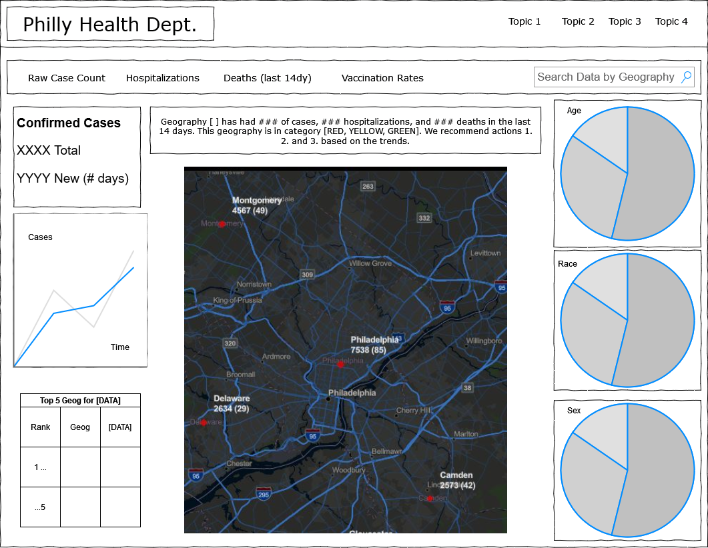

# Visualization of COVID-19 in Philadelphia

**By**:
* Anran Zheng, anranz@design.upenn.edu
* Johnathan Clementi, clementi@design.upenn.edu
* Lan Xiao, 

## Abstract

## Data Sources
We choose four aspects of COVID-19 data, confirmed cases, hospitalization, death and vaccination mainly from [OpenDataPhilly](https://www.opendataphilly.org/dataset/covid-cases). Some data from [CDC](https://data.cdc.gov/browse) might also be considered. The data form that we will utilized in our project includes csv, geojson, shp and API.  We will also use the aggregated number by different groups of sex, race and age categories provided by all these datasets. Both real-time and historical data by ZIP is needed in our project. All the datasets are open-accessed to us. 

**Test and cases:** -- [OpenDataPhilly](https://www.opendataphilly.org/dataset/covid-cases), updated "daily" at 4 pm every day (according to city [metadata](https://metadata.phila.gov/#home/datasetdetails/5ea725f6890f920015c17af8/representationdetails/5ea73b68890f920015c190d3/)). 

**Hospitalization:** -- [OpenDataPhilly](https://www.opendataphilly.org/dataset/covid-hospitalizations), updated "daily" at 4 pm every day (according to city [metadata](https://metadata.phila.gov/#home/datasetdetails/5efb5dc2bec0b10015172d9b/representationdetails/5efb6f4a2f3c4c00199b0c84/))

**Death:** -- [OpenDataPhilly](https://www.opendataphilly.org/dataset/covid-deaths), updated "daily" at 4 pm every day (according to city [metadata](https://metadata.phila.gov/#home/datasetdetails/5efb5dc2bec0b10015172d9b/representationdetails/5efb6f4a2f3c4c00199b0c84/))

**Vaccine:** -- [OpenDataPhilly](https://www.opendataphilly.org/dataset/covid-vaccinations), updated "daily" at 4 pm every day (according to city [metadata](https://metadata.phila.gov/#home/datasetdetails/601abeb9f910a2001ce794e2/representationdetails/60b93022a59bf60021d2a63a/))

**COVID Cumulative Historical Snapshots:** -- [OpenDataPhilly](https://www.opendataphilly.org/dataset/covid-cumulative-historical-data), updated "daily" at 4 pm every day.

## Wireframes

